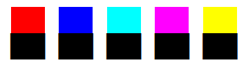

# tim - <strong><i>T</i></strong>erminal <strong><i>im</i></strong>age viewer


_Source for the [dog video](https://www.reddit.com/r/Eyebleach/comments/atco4s/golden_girl_spots_her_dad_on_the_street/)_

## Usage

Build from source by running `make`.
Building requires OpenCV 4 to be installed and clang with c++17 support, but the Makefile is just one command so you can easily adapt it work with e.g. `gcc` or anything else.

View an image:

```bash
./tim images/planets.jpg
./tim images/lena.png
```

Play a video:
```bash
./tim videos/dog.mp4
```
You can resize the terminal while a video is playing and the resolution will adjust automatically.


## How does it work?

The idea is turn every pixel of the source image into a character in the terminal (modulo resizing to make sure the image fits). Using the VT100 escape sequences,
we can control the color for each individual character that we print. To get a uniform color for each character, we could use the block character `█`. However, we can pack the pixels more densely by using the Unicode Lower Half Block character `▄` (`\u2584`). This gives two pixels per character by setting the foreground and background colors for each character.



These 'pixels' also resemble a square a bit more than the normal height characters so as a bonus, the image is not too stretched.

